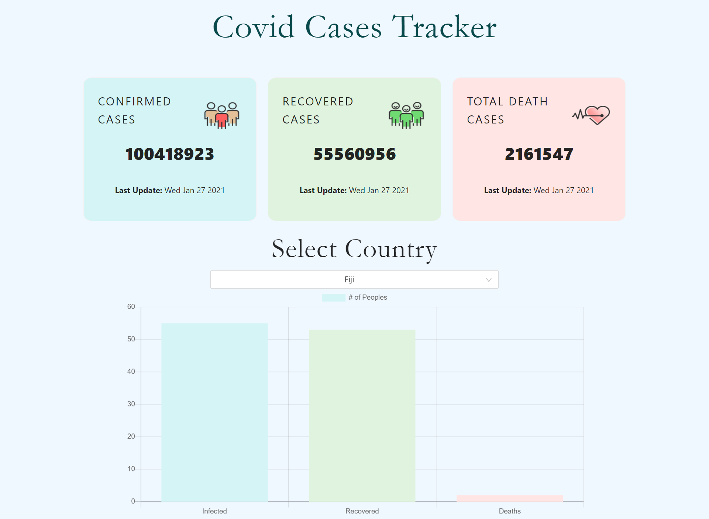

# Covid Tracker application

## LIVE LINK

[Go to website](http://react-covid-tracker-mugheera.surge.sh/)

This is a very simple web application developed on ReactJS. This is a covid tracker app. You can see the covid statistics globally and by choosing specific country.

## Project Specification

<ul>
   <li>ReactJS</li>
   <li>ChartJS</li>
   <li>React Suspense</li>
   <li>Antd</li>
 </ul>

## Setup

run npm i && npm start

## API

<ul>
    <li>https://covid19.mathdro.id/api</li>
    <li>https://covid19.mathdro.id/api/countries</li>
    <li>https://covid19.mathdro.id/api/countries/${country}</li>
</ul>
